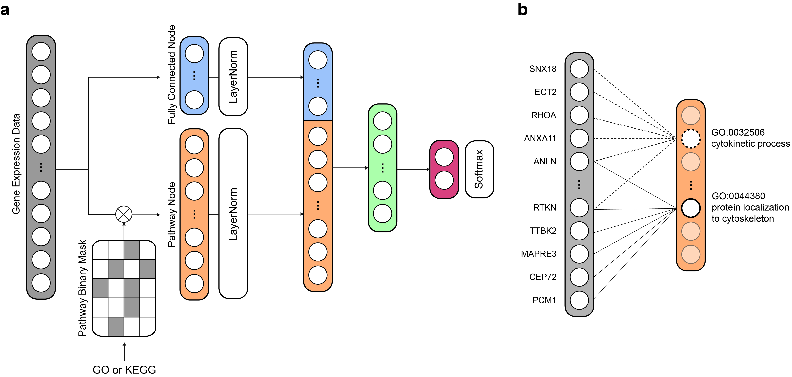

# PINNet: a deep neural network with pathway prior knowledge for Alzheimer's disease

Supporting Information for the paper "[PINNet: a deep neural network with pathway prior knowledge for Alzheimer's disease]()"

PINNet is a deep neural network (DNN) model with pathway prior knowledge from either the Gene Ontology or Kyoto Encyclopedia of Genes and Genomes databases.

## Dataset
All gene expression data used in this paper are available and can be accessed here: [GSE33000](https://www.ncbi.nlm.nih.gov/geo/query/acc.cgi?acc=gse33000) and [ADNI](https://adni.loni.usc.edu/).

## Get Started 
1. Install [requirements.txt](./requirements.txt) to set up the envirnoment.
2. All default arguments for demo are provided in the [dataPre.py](./src/dataPre.py).
3. Run the [main.py](./src/main.py) to train and test the model.
